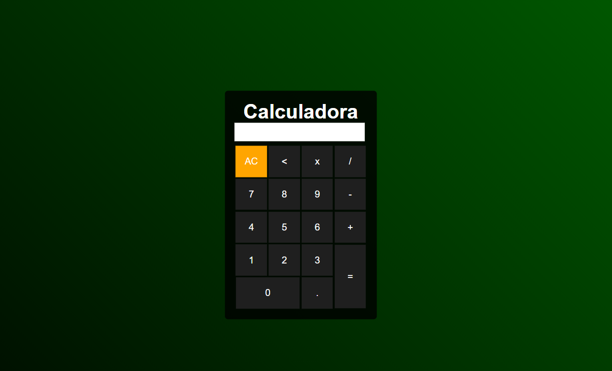

<h1 align="center">
  
</h1>

# Calculadora Simples

## Descrição
Uma simples calculadora desenvolvida com JavaScript, CSS e HTML. Tem apenas as operações de multiplicação, divisão, soma e subtração. É possivel apagar caso digite algo errado no visor.

## Tecnologias utilizadas:
- JavaScript
- CSS
- HTML
